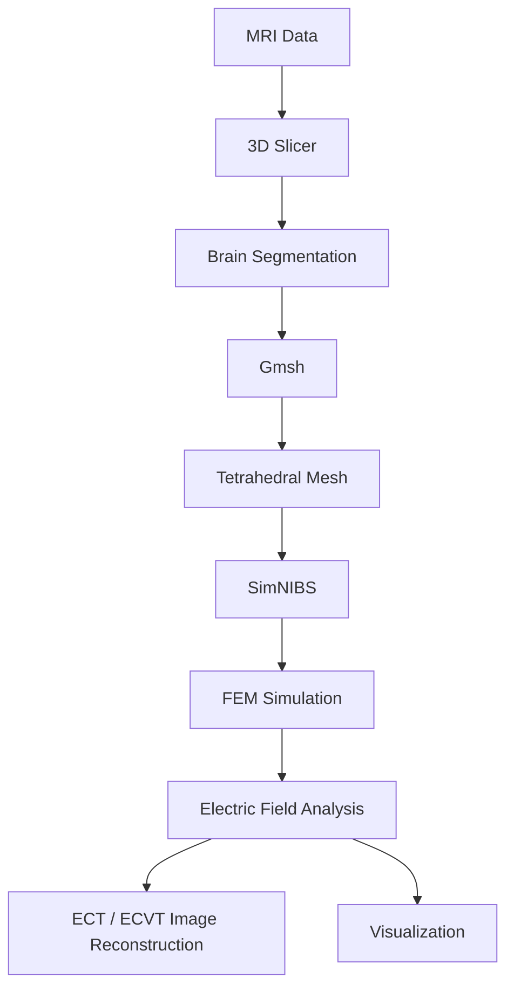

# Building a Brain FEM Pipeline for Dementia Research

## Overview

This project focuses on developing a computational brain modeling pipeline for dementia research.

The primary objective is to construct a patient-specific finite element model (FEM) from MRI data and utilize it for electrical property analysis, electric field simulation, and future ECT/ECVT-based dielectric image reconstruction.

Ultimately, this research aims to contribute to the development of a non-invasive dementia diagnosis and treatment monitoring system through computational modeling. :contentReference[oaicite:0]{index=0}

---

# Research Objective

The goal of this project is to build an end-to-end computational workflow capable of

- Constructing patient-specific brain FEM models
- Simulating electrical fields inside the brain
- Analyzing tissue dielectric properties
- Supporting ECT/ECVT image reconstruction
- Providing a computational foundation for dementia diagnosis

---

# Research Pipeline

The entire workflow transforms MRI scans into patient-specific finite element models for electrical analysis. :contentReference[oaicite:1]{index=1}

---

# Software Stack

| Software | Purpose |
|----------|---------|
| OASIS | MRI Dataset |
| 3D Slicer | Brain Segmentation |
| Gmsh | Mesh Generation |
| SimNIBS | Electric Field Simulation |
| Python | Pipeline Automation |
| NumPy | Numerical Computing |
| SciPy | Sparse Matrix Operations |
| PyAMG | Large-scale FEM Solver |
| Matplotlib | Visualization |

---

# MRI Segmentation

MRI images are processed using **3D Slicer**.

After segmentation, anatomical structures are exported as STL models before tetrahedral mesh generation.

This step provides the geometric foundation for finite element analysis.

---

# Mesh Generation

The segmented brain model is converted into a tetrahedral mesh using **Gmsh**.

The generated mesh preserves anatomical structures while remaining suitable for numerical simulations.

---

# Finite Element Simulation

The tetrahedral mesh is imported into **SimNIBS**, where finite element simulations are performed.

The simulation computes

- Electric Potential
- Electric Field
- Current Density

inside the brain.

These results provide the physical basis for dielectric property analysis and future ECT reconstruction.

---

# Computational Challenges

Developing a large-scale FEM pipeline involved several technical challenges.

## Mesh Compatibility

Different software packages require different mesh formats.

Mesh compatibility issues were resolved through preprocessing and format conversion.

---

## Large-scale Sparse Solver

The brain model contains hundreds of thousands of nodes and millions of tetrahedral elements.

Efficient sparse linear solvers were therefore essential for large-scale FEM computation.

PyAMG was adopted for scalable numerical solving. :contentReference[oaicite:2]{index=2}

---

# Future Research

The current pipeline will be extended toward

- Brain dielectric property estimation
- ECT/ECVT image reconstruction
- Sensitivity analysis
- Inverse problem solving
- Dementia diagnosis support
- Treatment monitoring

These components will ultimately be integrated into a computational framework for dementia diagnosis and monitoring. :contentReference[oaicite:3]{index=3}

---

# Current Progress

- ✅ MRI preprocessing
- ✅ Brain segmentation
- ✅ Mesh generation
- ✅ SimNIBS environment construction
- ✅ FEM simulation pipeline
- 🔄 ECT/ECVT reconstruction
- 🔄 Inverse problem optimization
- 🔄 Dementia diagnosis framework

---

# Conclusion

This project aims to integrate medical imaging, finite element analysis, and computational modeling into a unified research framework for dementia.

By combining MRI processing, FEM simulation, and dielectric property analysis, the proposed pipeline provides a foundation for future non-invasive diagnosis, treatment monitoring, and computational neuroscience research.
